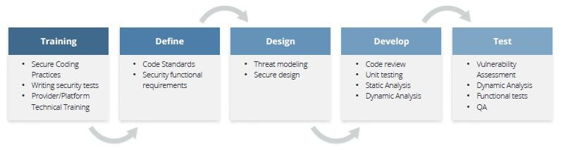
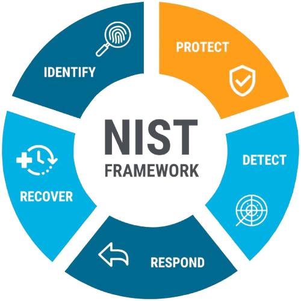

# Cloud Architecture - Hybrid Cloud, Compliance & Risk Management  

## 📌 Executive Summary  
This case study explores the design and implementation of a **secure, scalable, and compliant cloud architecture** for a rapidly expanding IT consultancy specializing in IoT services on **Microsoft Azure**. The project covers four critical domains:  

- **Cloud Service & Deployment Models** (choosing PaaS and Hybrid Cloud to balance scalability, governance, and performance).  
- **Regulatory Compliance** (GDPR, CCPA, ISO 27001, cross-border data frameworks).  
- **Security Training & Governance** (integrating SSDLC best practices and Microsoft SDL framework).  
- **Risk Management & Continuity Planning** (using NIST CSF to design resilience against global-scale threats).  

The outcome demonstrates a practical approach to **hybrid cloud adoption, regulatory alignment, workforce training, and business continuity planning**, ensuring long-term resilience and growth in a global environment.  

---

## 📑 Table of Contents  

- [Cloud Service & Deployment Strategy](#cloud-service--deployment-strategy)  
  - [Service Model: Platform as a Service (PaaS)](#service-model-platform-as-a-service-paas)  
  - [Deployment Model: Hybrid Cloud](#deployment-model-hybrid-cloud)  
  - [Trade-Offs Analysis](#trade-offs-analysis)  

- [Regulatory & Compliance Framework](#regulatory--compliance-framework)  
  - [Applicable Regulations (GDPR, CCPA, ISO 27001, Cross-Border Transfers)](#applicable-regulations)  
  - [Compliance Recommendations](#compliance-recommendations)  

- [Security Training & Development Lifecycle](#security-training--development-lifecycle)  
  - [Training Phases for New Developers & Architects](#training-phases-for-new-developers--architects)  
  - [Microsoft SDL Framework Adoption](#microsoft-sdl-framework-adoption)  
  - [Secure Development Practices](#secure-development-practices)  

- [Risk Management & Business Continuity](#risk-management--business-continuity)  
  - [Security Plan with NIST CSF Core Elements](#security-plan-with-nist-csf-core-elements)  
  - [Risk Assessment for bcdr](#risk-assessment-for-bcdr)  
  - [Recommendations for Disaster Recovery](#recommendations-for-disaster-recovery)  

---

## 1. Cloud Service & Deployment Strategy  

### 1.1 Service Model: Platform as a Service (PaaS)  
📊 **Recommendation:** Utilize **PaaS** for IoT development and analytics.  

  

**Advantages:**  
- 🔧 **Development Efficiency**: APIs and toolsets accelerate IoT solution development. By reducing the operational burden of managing infrastructure, teams can focus directly on building scalable IoT services.  
- 📈 **Scalability**: Auto-scaling to handle large IoT data streams. This ensures elasticity when demand spikes, which is vital for sensor-driven environments.  
- 🛡 **Governance**: Integration with SLAs and risk management frameworks. PaaS inherently offers stronger control layers compared to SaaS, making it more suitable for IoT.  
- 💰 **Cost Control**: Reduced infrastructure overhead compared to IaaS. PaaS strikes a balance between flexibility and cost efficiency.  

---

### 1.2 Deployment Model: Hybrid Cloud  
📊 **Recommendation:** Adopt a **Hybrid Cloud** (private + public Azure).  

  

**Advantages:**  
- 🌍 **Global Expansion**: Ensures compliance with data sovereignty rules across EU and US while enabling worldwide deployment.  
- ⚡ **Availability**: Multi-region deployments for high availability, supporting disaster recovery scenarios and round-the-clock uptime.  
- 🛡 **Governance**: Centralized governance across multiple clouds ensures alignment with both internal policies and international regulations.  
- 📊 **IoT Data Handling**: Sensitive IoT data can be processed locally in private clouds, while large-scale analytics leverage public cloud compute power.  

---

### 1.3 Trade-Offs Analysis  

| **Factor**        | **Hybrid Cloud Impact**                                                                 |
|--------------------|-----------------------------------------------------------------------------------------|
| Complexity         | Requires governance across multiple environments, adding management overhead.           |
| Cost               | Private cloud is more expensive but offers better control and compliance assurance.     |
| Interoperability   | Standardized APIs and clear integration patterns are required to ensure system harmony. |
| Latency/Bandwidth  | Offices in dispersed regions may face delays, necessitating optimized VPN or peering.  |  

Hybrid cloud is not the cheapest or simplest model, but it is often the **most resilient and compliant choice** for global enterprises handling sensitive IoT workloads.  

---

## 2. Regulatory & Compliance Framework  

### 2.1 Applicable Regulations  

- **European Union – GDPR**: Protects EU citizens’ personal data; anonymization and access restrictions are mandatory. This is critical for IoT deployments in Germany and across Europe.  
- **United States – CCPA & Federal Laws (GLBA, HIPAA, COPPA)**: Establish privacy and security standards for handling consumer data, with specific state-level laws adding further obligations.  
- **Cross-Border Data Transfers – EU–US Data Privacy Framework**: Enables lawful data transfers while upholding GDPR principles, crucial for multi-region operations.  
- **ISO/IEC 27001**: A recognized global standard for information security management, strengthening internal governance structures and IoT data protection.  

---

### 2.2 Compliance Recommendations  

1. 🔎 **Continuous Compliance & Auditing** – Must be embedded into operations, not treated as a one-off exercise. Cloud environments are dynamic, and compliance must evolve continuously.  
2. ☁️ **Cloud Providers’ Responsibilities** – Providers must share certifications, audit logs, and SLA compliance evidence to maintain trust.  
3. 👩‍💻 **Cloud Customers’ Responsibilities** – Organizations must validate providers’ claims, maintain compliance registers, and ensure alignment with internal security policies.  

By adopting these practices, the organization demonstrates proactive risk management and readiness for audits in both EU and US markets.  

---

## 3. Security Training & Development Lifecycle  

  

### 3.1 Training Phases for New Developers & Architects  
- **Cloud Security Fundamentals**: Teach shared responsibility models in Azure, covering AD, Key Vault, and Policy.  
- **Provider-Specific Training**: Focus on real-world application of Azure-native security services to reduce misconfiguration risks.  
- **Secure Coding Practices**: Train developers with OWASP Top 10 to prevent common vulnerabilities such as injection and XSS.  

This training equips staff not only with theoretical knowledge but also with **practical, hands-on security skills**.  

---

### 3.2 Microsoft SDL Framework Adoption  
📊 **Recommendation:** Adopt **Microsoft Security Development Lifecycle (SDL)**.  

**Why:**  
The SDL ensures that security is integrated at every stage of development, emphasizing secure coding, early vulnerability detection, and continuous monitoring. Unlike generic frameworks, SDL is directly aligned with Microsoft Azure services, which the company already uses.  

---

### 3.3 Secure Development Practices  
- Use **CI/CD pipelines** with secured repositories (Azure DevOps) to enforce code integrity.  
- Conduct **Static & Dynamic Testing (SAST & DAST)** early to minimize late-stage vulnerabilities.  
- Apply **Threat Modeling** for cloud-specific risks such as identity attacks.  
- Perform **Automated Penetration Testing** with Azure Defender and Security Center.  

Embedding these practices transforms security from a compliance obligation into a **core development culture**.  

---

## 4. Risk Management & Business Continuity  

### 4.1 Security Plan with NIST CSF Core Elements  
- **Identify**: Map risks related to data sovereignty, legal frameworks, and critical infrastructure.  
- **Protect**: Enforce access control, encryption, and segmentation across global offices.  
- **Detect**: Deploy monitoring and advanced detection tools to ensure visibility across EU and US networks.  
- **Respond**: Build a global incident response plan harmonized with GDPR, NIS, and US laws.  
- **Recover**: Implement geo-redundant backup and recovery plans across multiple Azure regions.  

  

The NIST CSF provides a **structured and flexible approach**, ensuring resilience and compliance simultaneously.  

---

### 4.2 Risk Assessment for BC/DR  

**Challenges:**  
- Reliance on third-party cloud introduces risks of dependency and lock-in.  
- Balancing high availability with cost efficiency is a recurring challenge.  

**Recommendations:**  
- Architect for failure with multi-zone deployments and auto-scaling.  
- Evaluate outage risks and align redundancy with critical business functions.  
- Demand transparency from providers on DR capabilities such as failover and replication.  
- Regularly test disaster recovery playbooks to ensure readiness.  

This ensures the organization can **withstand disruptions without compromising service availability**.  

---

### 4.3 Recommendations for Disaster Recovery  
- Use **cross-region replication** and **automatic failover** to minimize downtime.  
- Consider **multi-cloud strategies** to mitigate single-provider dependency.  
- Conduct frequent **BC/DR drills** to validate plans against real-world failure scenarios.  

By embedding resilience into the architecture, the organization moves from a reactive posture to a **proactive, business-driven continuity model**.  

---

## ✅ Key Insights  
- Hybrid Cloud + PaaS ensures **scalability, compliance, and flexibility** for IoT growth.  
- GDPR, CCPA, and ISO 27001 are **critical compliance anchors** for global operations.  
- Security training using **Microsoft SDL** builds a culture of security-aware developers and architects.  
- NIST CSF + BC/DR strategies ensure the business remains resilient even under global-scale incidents.  

---

## 📚 References  
- Cloud Security Alliance (CSA), *Security Guidelines for Critical Areas of Focus in Cloud Computing* (Domains 3–6).  
- Microsoft Azure Documentation – Hybrid Cloud, PaaS, Compliance, and Security.  
- NIST Cybersecurity Framework (CSF).  
- ISO/IEC 27001 Standards.  
- Course lectures & core textbooks (Cloud Security, Governance, Risk, and Compliance).  

