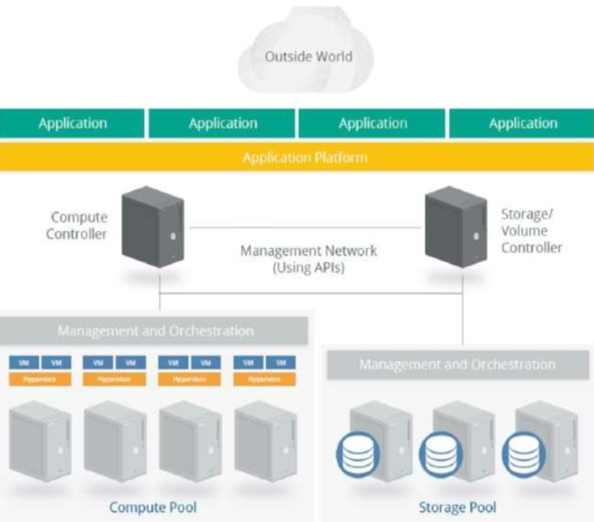

# Cloud Architecture - Hybrid Cloud, Compliance & Risk Management  

## 📌 Executive Summary  

This project began with a clear dilemma: how can a fast-growing IT consultancy expand its IoT services across Europe and the United States while still ensuring scalability, compliance, and resilience? The company’s growth created constant pressure to innovate while at the same time meeting strict requirements for governance, performance, and security. Each new client and each new region added new challenges in data sovereignty, cross-border compliance, and secure workload orchestration.  

To address this, I designed a hybrid cloud security architecture that strikes the right balance between efficiency and control. The solution is built on four key pillars:  

- **Cloud Service & Deployment Strategy**: Leveraging PaaS to accelerate IoT development and adopting a hybrid cloud model to combine sovereignty, performance, and flexibility.  
- **Regulatory Compliance Alignment**: Embedding GDPR, CCPA, ISO 27001, and EU–US data transfer frameworks to ensure operations remain lawful and auditable.  
- **Security Training & Governance**: Creating a secure development culture by applying SSDLC practices and the Microsoft SDL framework so that security is integrated from the ground up.  
- **Risk Management & Continuity Planning**: Using the NIST Cybersecurity Framework to strengthen monitoring, incident response, and disaster recovery across Azure’s global infrastructure.  

The outcome is more than just a cloud migration strategy. It is a blueprint for long-term resilience that shows how difficult trade-offs between cost, compliance, and performance can be transformed into a practical architecture that supports rapid growth and builds trust with both clients and regulators.  

---

## 📑 Table of Contents  

- [Cloud Service & Deployment Strategy](#cloud-service--deployment-strategy)  
  - [Service Model: Platform as a Service (PaaS)](#service-model-platform-as-a-service-paas)  
  - [Deployment Model: Hybrid Cloud](#deployment-model-hybrid-cloud)  
  - [Trade-Offs Analysis](#trade-offs-analysis)  

- [Regulatory & Compliance Framework](#regulatory--compliance-framework)  
  - [Applicable Regulations (GDPR, CCPA, ISO 27001, Cross-Border Transfers)](#applicable-regulations)  
  - [Compliance Recommendations](#compliance-recommendations)  

- [Security Training & Development Lifecycle](#security-training--development-lifecycle)  
  - [Training Phases for New Developers & Architects](#training-phases-for-new-developers--architects)  
  - [Microsoft SDL Framework Adoption](#microsoft-sdl-framework-adoption)  
  - [Secure Development Practices](#secure-development-practices)  

- [Risk Management & Business Continuity](#risk-management--business-continuity)  
  - [Security Plan with NIST CSF Core Elements](#security-plan-with-nist-csf-core-elements)  
  - [Risk Assessment for BC/DR](#risk-assessment-for-bcdr)  
  - [Recommendations for Disaster Recovery](#recommendations-for-disaster-recovery)  

---

## Cloud Service & Deployment Strategy  

### Service Model: Platform as a Service (PaaS)  
📊 **Recommendation:** Utilize **PaaS** for IoT development and analytics.  

  

**Advantages:**  
- 🔧 **Development Efficiency**: APIs and toolsets accelerate IoT solution development. By reducing the operational burden of managing infrastructure, teams can focus directly on building scalable IoT services.  
- 📈 **Scalability**: Auto-scaling to handle large IoT data streams. This ensures elasticity when demand spikes, which is vital for sensor-driven environments.  
- 🛡 **Governance**: Integration with SLAs and risk management frameworks. PaaS inherently offers stronger control layers compared to SaaS, making it more suitable for IoT.  
- 💰 **Cost Control**: Reduced infrastructure overhead compared to IaaS. PaaS strikes a balance between flexibility and cost efficiency.  

---

### Deployment Model: Hybrid Cloud  
📊 **Recommendation:** Adopt a **Hybrid Cloud** (private + public Azure).  

  

**Advantages:**  
- 🌍 **Global Expansion**: Ensures compliance with data sovereignty rules across EU and US while enabling worldwide deployment.  
- ⚡ **Availability**: Multi-region deployments for high availability, supporting disaster recovery scenarios and round-the-clock uptime.  
- 🛡 **Governance**: Centralized governance across multiple clouds ensures alignment with both internal policies and international regulations.  
- 📊 **IoT Data Handling**: Sensitive IoT data can be processed locally in private clouds, while large-scale analytics leverage public cloud compute power.  

---

### Trade-Offs Analysis  

| **Factor**        | **Hybrid Cloud Impact**                                                                 |
|--------------------|-----------------------------------------------------------------------------------------|
| Complexity         | Requires governance across multiple environments, adding management overhead.           |
| Cost               | Private cloud is more expensive but offers better control and compliance assurance.     |
| Interoperability   | Standardized APIs and clear integration patterns are required to ensure system harmony. |
| Latency/Bandwidth  | Offices in dispersed regions may face delays, necessitating optimized VPN or peering.  |  

Hybrid cloud is not the cheapest or simplest model, but it is often the **most resilient and compliant choice** for global enterprises handling sensitive IoT workloads.  

---

## Regulatory & Compliance Framework  

### Applicable Regulations  

- **European Union – GDPR**: Protects EU citizens’ personal data; anonymization and access restrictions are mandatory. This is critical for IoT deployments in Germany and across Europe.  
- **United States – CCPA & Federal Laws (GLBA, HIPAA, COPPA)**: Establish privacy and security standards for handling consumer data, with specific state-level laws adding further obligations.  
- **Cross-Border Data Transfers – EU–US Data Privacy Framework**: Enables lawful data transfers while upholding GDPR principles, crucial for multi-region operations.  
- **ISO/IEC 27001**: A recognized global standard for information security management, strengthening internal governance structures and IoT data protection.  

---

### Compliance Recommendations  

1. 🔎 **Continuous Compliance & Auditing** – Must be embedded into operations, not treated as a one-off exercise. Cloud environments are dynamic, and compliance must evolve continuously.  
2. ☁️ **Cloud Providers’ Responsibilities** – Providers must share certifications, audit logs, and SLA compliance evidence to maintain trust.  
3. 👩‍💻 **Cloud Customers’ Responsibilities** – Organizations must validate providers’ claims, maintain compliance registers, and ensure alignment with internal security policies.  

By adopting these practices, the organization demonstrates proactive risk management and readiness for audits in both EU and US markets.  
