# Cloud-Defense-Security-Project

## System Perfomance Benchmarking and Load Testing
This part of the project demonstrates how to analyze system resources, test performance under load, compare a web server on the host versus in a container, and perform stress tests with high concurrency.

### 1. System Information Analysis
#### a) CPU / Cores and Bogomips
The first step towards perfomance benchmarking and load testing is collecting information about system's processor. This includes number of cores and the Bogomips value per core, providing a baseline understanding of the system's capacity and hardware characteristics.

The screenshot shows the result of running the `lscpu` command, which provides details such as CPU architecture, model, number of cores, and the Bogomips value.
<br></br>

 **Number of CPUs/Core:** 2   **BogoMips per core:** 5587.06  
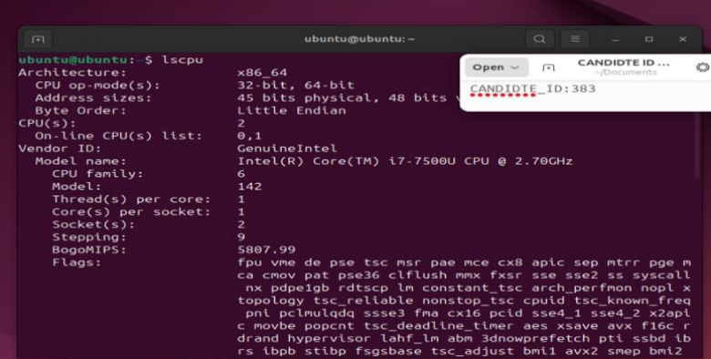 

---


`lscpu` also lists CPU vulnerabilities along with mitigation details as shown under, which show the security measures the system applies to reduce the risk of exploiting known hardware vulnerabilities.

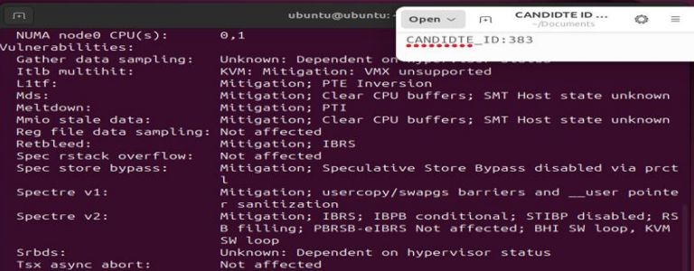 

---

*Additionally, `cat /proc/cpuinfo | grep bogomips` can be used to confirm the Bogomips value directly from the CPU info file, showing identical results for each core.*

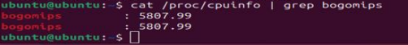 


**Commands Used:**
```bash
# Display detailed CPU architecture, including cores, threads, bogomips, and vulnerabilities
lscpu

# Verify bogomips value directly from /proc/cpuinfo for each core
cat/proc/cpuinfo | grep bogomips

```


#### b) Open Network Ports

Checking open ports helps verify which services are actively listening on the system. 
In this project, the purpose is to confirm that only the necessary services (e.g., NGINX for load testing) are running, 
so that performance benchmarks take place in a controlled environment without interference from unrelated processes. 
Unnecessary services can be disabled to avoid extra resource usage or unintended exposure.


To list the open network ports, the command `ss -tuln` was used.  
This is the modern replacement for `netstat -tuln` and provides the same information 
about active TCP and UDP sockets.
<br></br>

**Open Ports:** 53 (UDP/TCP), 631 (UDP/TCP), 5353 (UDP), 44170 (UDP), 47868 (UDP)

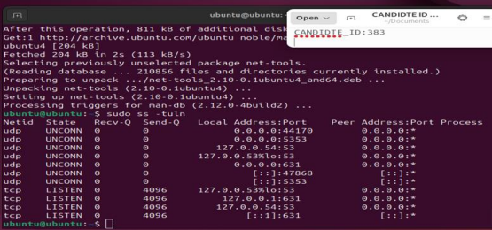

**Commands Used:**
```bash
# List all listening TCP and UDP ports with socket details
ss -tuln
```


### 2. Webserver Setup and Local Load Testing
#### a) Nginx Installation

The next step is to set up a web server to be used for load testing.  
For this project, **Nginx** was chosen due to its lightweight design and high performance.  

Nginx was successfully installed and started on the VM by running `sudo apt install nginx`.  
The installation process downloaded and configured the necessary packages.


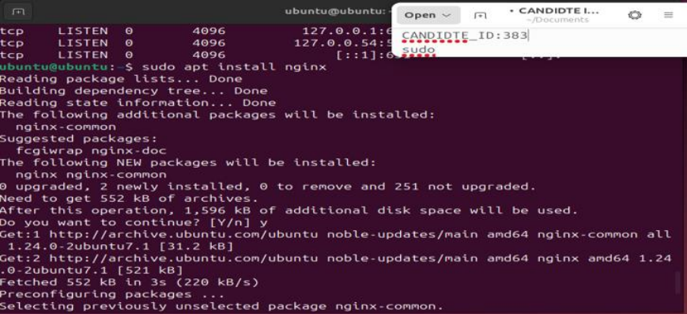

---

The Service status was verified using `systemctl status nginx` to confirm that the server was active and running.

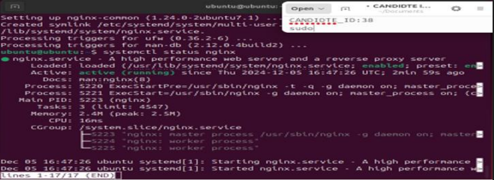


**Commands Used:**  
```bash
# Install the Nginx web server package
sudo apt install nginx

# Check that the Nginx service is loaded, enabled, and running
systemctl status nginx
```

#### b) Simulating DDoS Attack

**ApacheBench Load Test**

The command `ab -n 100000 -c 100 http://127.0.0.1/` was used to simulate 100,000 requests with a concurrency level of 100.  
This kind of stress test is designed to evaluate how the web server handles a sudden burst of requests, which resembles a Denial-of-Service (DoS) scenario.  

The picture under shows the execution progress of ApacheBench, including milestones of completed requests and the final summary confirming that all 100,000 requests were processed successfully without errors.

This demonstrates that the server was capable of maintaining stability under significant load.

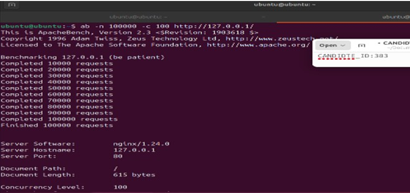

---
**CPU Load Monitoring**

While the ApacheBench test was running, system resource usage was monitored using the `htop` command. The picture shows CPU utilization during the peak of the test, where the highest observed load reached **26%**.

This indicates that the system had sufficient spare capacity and was not fully saturated, which suggests that the hardware could handle an even higher load or additional concurrent processes. Monitoring resource usage alongside benchmark testing is critical to identifying potential bottlenecks such as CPU saturation, memory exhaustion, or I/O limitations.  

In this case, the relatively low CPU load under stress confirms that the bottleneck, if any, would more likely be in network throughput or application-level constraints rather than raw processing power.


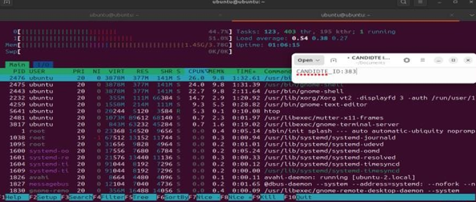


**Commands Used:**  
```bash
# Run ApacheBench with 100,000 requests and concurrency level 100
ab -n 100000 -c 100 http://127.0.0.1/

# Monitor system resources during the load test
htop
```


### 3. Containerized Load Testing with Docker

**Load Testing with Docker**
#### a) Installing Docker
Docker was introduced at this stage to extend the benchmarking from a bare-metal setup into a containerized environment. It was installed on the system using `sudo apt install docker.io`, and the Nginx web server was later started inside a container with `sudo docker run -d -p 80:80 nginx`. This made it possible to compare raw host performance with containerized performance, reflecting modern deployment practices where containers are widely used.  

A containerized setup ensures consistency by packaging the application with its dependencies, while also providing process isolation and options for fine-grained resource control. This allows for reproducible experiments and highlights the trade-off between efficiency and flexibility.  

In practice, repeating the experiment in Docker not only offers comparative data, but also mirrors industry-standard approaches where containerization and orchestration platforms such as Kubernetes are central to scalable deployments.

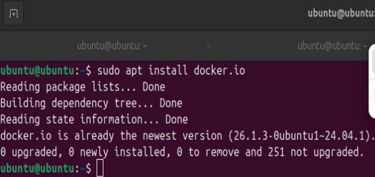

**Commands Used:**  
```bash
# Install Docker engine
sudo apt install docker.io

# Run an Nginx container on port 80
sudo docker run -d -p 80:80 nginx
```

#### b) Simulating DDoS Attack in Docker

After installing Docker and running Nginx inside a container, the same Apache Benchmark (ab) stress test was repeated to observe performance differences compared to running Nginx directly on the host.

The goal was to evaluate how containerization impacts CPU utilization and request handling under heavy load.

**Apache Benchmark Execution (ab):**
The following image shows the execution of the Apache Benchmark command:

`ab -n 100000 -c 100 http://127.0.0.1/`

This command simulates 100,000 HTTP requests with a concurrency level of 100, targeting the Nginx server running inside Docker. The output confirms the completion of all requests.

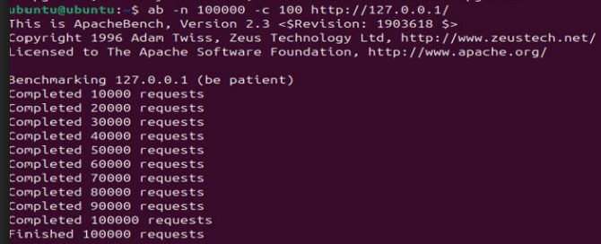

---

**System Resource Monitoring (htop):**  

The system resource usage was monitored in real-time using the `htop` command.

The following screenshot shows the system resource usage during the load test, monitored in real time with the `htop` command.

The CPU utilization peaked at approximately **9.8%** 

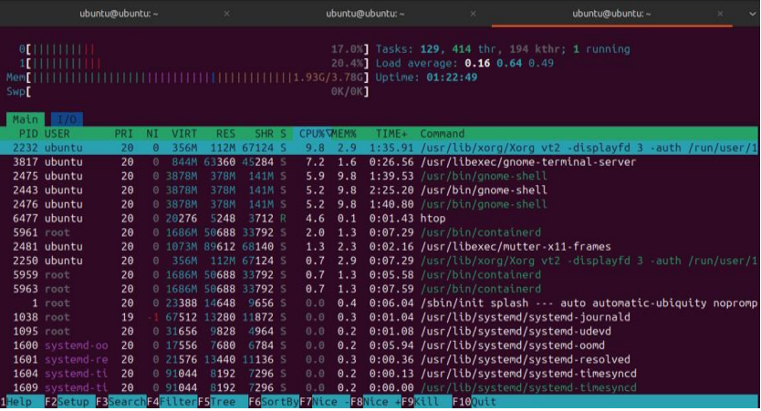


**Commands Used:**  
```bash
# Simulate 100,000 HTTP requests with concurrency 100 inside Docker
ab -n 100000 -c 100 http://127.0.0.1/

# Monitor CPU load while the container is under stress
htop
```


<!-- which is significantly lower than the **26%** observed when running Nginx directly on the host system. This demonstrates the performance differences introduced by containerization.-->


#### c) Comparison: Host vs Docker

The benchmarking results reveal a clear distinction between running **Nginx directly on the host system** versus inside a **Docker container**. Both tests were executed under identical conditions with ApacheBench (`ab -n 100000 -c 100`), ensuring the comparison is **fair and reproducible**.  

---

📊 **Benchmark Summary**

| Environment       | Requests Sent | Concurrency | Peak CPU Load |
|-------------------|---------------|-------------|---------------|
| 🖥️ Host (bare-metal) | 100,000       | 100         | 🔴 **26%**    |
| 📦 Docker container  | 100,000       | 100         | 🟢 **9.8%**   |


🔎 **Analysis**  

- On bare metal, CPU utilization peaked at **26%**, while the Dockerized environment consumed **less than half** of that at **9.8%**.  
- Containerization introduces measurable differences in **workload scheduling** and **isolation** at the system level.  
- The reduced CPU load in Docker highlights how **abstraction layers** can enable more efficient task distribution, though at the expense of an additional software stack between the hardware and application.  
- This demonstrates the trade-off between:  
  - ⚡ **Maximum raw performance** (host)  
  - 🔄 **Operational benefits** (Docker) — portability, reproducibility, and alignment with cloud-native deployment models.  


✅ **Key Takeaway:**  
This comparison validates the **functional equivalence** of both setups while showing why containerized environments dominate modern infrastructure: they balance **efficiency, scalability, and isolation** against minimal performance overhead.


### 4. High-Concurrency Stress Test
